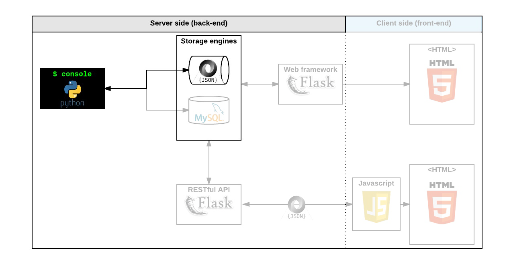

<div align="center">
<br>


</div>


<p align="center">


</p>


<h1 align="center"> AirBnB clone - The console </h1>


<h3 align="center">
<a href="https://github.com/RazikaBengana/holbertonschool-AirBnB_clone#eye-about">About</a> •
<a href="https://github.com/RazikaBengana/holbertonschool-AirBnB_clone#hammer_and_wrench-tasks">Tasks</a> •
<a href="https://github.com/RazikaBengana/holbertonschool-AirBnB_clone#memo-learning-objectives">Learning Objectives</a> •
<a href="https://github.com/RazikaBengana/holbertonschool-AirBnB_clone#computer-requirements">Requirements</a> •
<a href="https://github.com/RazikaBengana/holbertonschool-AirBnB_clone#keyboard-more-info">More Info</a> •
<a href="https://github.com/RazikaBengana/holbertonschool-AirBnB_clone#mag_right-resources">Resources</a> •
<a href="https://github.com/RazikaBengana/holbertonschool-AirBnB_clone#bust_in_silhouette-authors">Authors</a> •
<a href="https://github.com/RazikaBengana/holbertonschool-AirBnB_clone#octocat-license">License</a>
</h3>

---

<!-- ------------------------------------------------------------------------------------------------- -->

<br>
<br>

## :eye: About

<br>

<div align="center">

**`AirBnB clone - the console`** project is the first version of a four-part progressive implementation, focusing on creating a **backend system** for managing property rentals.
<br>
<br>
The programs define a set of Python classes representing entities like `User`, `Place`, and `Review`, all inheriting from a `BaseModel`, and implement a **command-line interface (CLI)** for creating, retrieving, updating, and deleting these objects.
<br>
This initial version also includes a custom **file storage engine** for persisting objects to JSON and a suite of **unit tests**, laying the groundwork for future development of a more complex web application.
<br>
<br>
This project has been created by **[Holberton School](https://www.holbertonschool.com/about-holberton)** to enable every student to understand how to build a fully functional web application.
<br>
<br>
Through hands-on development of core components, we gain practical experience in backend systems, data modeling, software architecture, and subsequently front-end web development skills.

</div>

<br>
<br>

<h1 align="center">
Welcome to the AirBnB clone project!
</h1>

<br>

### `HBNB`  (_"Holberton BnB"_) - Project overview:

<br>
<br>

[](https://www.youtube.com/watch?v=E12Xc3H2xqo&t=42s)

<br>
<br>

### Background Context

<br>
<br>

#### First step: Write a command interpreter to manage your AirBnB objects

<br>
<br>

This is the first step towards building your first full web application: the `AirBnB clone`. <br>
This first step is very important because you will use what you build during this project with all other following projects: `HTML`/`CSS` templating, database storage, API, front-end integration…

<br>

Each task is linked and will help you to:

- put in place a parent class (called `BaseModel`) to take care of the initialization, serialization and deserialization of your future instances

- create a simple flow of serialization/deserialization: Instance <-> Dictionary <-> JSON string <-> file

- create all classes used for AirBnB (`User`, `State`, `City`, `Place`…) that inherit from `BaseModel`

- create the first abstracted storage engine of the project: File storage.

- create all unittests to validate all our classes and storage engine

<br>
<br>

#### What’s a command interpreter?

<br>
<br>

Do you remember the Shell? It’s exactly the same but limited to a specific use-case.

<br>

In our case, we want to be able to manage the objects of our project:

- Create a new object (ex: a new `User` or a new `Place`)

- Retrieve an object from a file, a database etc…

- Do operations on objects (count, compute stats, etc…)

- Update attributes of an object

- Destroy an object

<br>
<br>

<!-- ------------------------------------------------------------------------------------------------- -->

## :hammer_and_wrench: Tasks

<br>

**`0. README, AUTHORS`**

**`1. Be pycodestyle compliant!`**

**`2. Unittests`**

**`3. BaseModel`**

**`4. Create BaseModel from dictionary`**

**`5. Store first object`**

**`6. Console 0.0.1`**

**`7. Console 0.1`**

**`8. First User`**

**`9. More classes!`**

**`10. Console 1.0`**

**`11. All instances by class name`**

**`12. Count instances`**

**`13. Show`**

**`14. Destroy`**

**`15. Update`**

**`16. Update from dictionary`**

**`17. Unittests for the Console!`**

<br>
<br>

<!-- ------------------------------------------------------------------------------------------------- -->

## :memo: Learning objectives

<br>

**_You are expected to be able to [explain to anyone](https://fs.blog/feynman-learning-technique/), without the help of Google:_**

<br>

```diff

General

+ How to create a Python package

+ How to create a command interpreter in Python using the cmd module

+ What is Unit testing and how to implement it in a large project

+ How to serialize and deserialize a Class

+ How to write and read a JSON file

+ How to manage datetime

+ What is an UUID

+ What is *args and how to use it

+ What is **kwargs and how to use it

+ How to handle named arguments in a function

```

<br>
<br>

<!-- ------------------------------------------------------------------------------------------------- -->

## :computer: Requirements

<br>

```diff
    
Python Scripts

+ Allowed editors: vi, vim, emacs

+ All your files will be interpreted/compiled on Ubuntu 20.04 LTS using python3 (version 3.8.5)

+ All your files should end with a new line

+ The first line of all your files should be exactly #!/usr/bin/python3

+ A README.md file, at the root of the folder of the project, is mandatory

+ Your code should use the pycodestyle (version 2.7.*)

+ All your files must be executable

+ The length of your files will be tested using wc

+ All your modules should have a documentation (python3 -c 'print(__import__("my_module").__doc__)')

+ All your classes should have a documentation (python3 -c 'print(__import__("my_module").MyClass.__doc__)')

+ All your functions (inside and outside a class) should have a documentation (python3 -c 'print(__import__("my_module").my_function.__doc__)' and python3 -c 'print(__import__("my_module").MyClass.my_function.__doc__)')

+ A documentation is not a simple word, it’s a real sentence explaining what’s the purpose of the module, class or method (the length of it will be verified)


Python Unit Tests

+ Allowed editors: vi, vim, emacs

+ All your files should end with a new line

+ All your test files should be inside a folder tests

+ You have to use the unittest module

+ All your test files should be python files (extension: .py)

+ All your test files and folders should start by test_

+ Your file organization in the tests folder should be the same as your project

+ e.g., For models/base_model.py, unit tests must be in: tests/test_models/test_base_model.py

+ e.g., For models/user.py, unit tests must be in: tests/test_models/test_user.py

+ All your tests should be executed by using this command: python3 -m unittest discover tests

+ You can also test file by file by using this command: python3 -m unittest tests/test_models/test_base_model.py

+ All your modules should have a documentation (python3 -c 'print(__import__("my_module").__doc__)')

+ All your classes should have a documentation (python3 -c 'print(__import__("my_module").MyClass.__doc__)')

+ All your functions (inside and outside a class) should have a documentation (python3 -c 'print(__import__("my_module").my_function.__doc__)' and python3 -c 'print(__import__("my_module").MyClass.my_function.__doc__)')

+ We strongly encourage you to work together on test cases, so that you don’t miss any edge case

```

<br>

**_Why all your files should end with a new line? See [HERE](https://unix.stackexchange.com/questions/18743/whats-the-point-in-adding-a-new-line-to-the-end-of-a-file/18789)_**

<br>
<br>

### GitHub

<br>

There should be one project repository per group. <br>
If you clone/fork/whatever a project repository with the same name before the second deadline, you risk a 0% score.

<br>
<br>

<!-- ------------------------------------------------------------------------------------------------- -->

## :keyboard: More Info

<br>

### Execution:

<br>

- Your shell should work like this in interactive mode:

<br>

```yaml
$ ./console.py
(hbnb) help

Documented commands (type help <topic>):
========================================
EOF  help  quit

(hbnb) 
(hbnb) 
(hbnb) quit
$
```

<br>
<br>

- But also in non-interactive mode: (like the Shell project in C):

<br>

```yaml
$ echo "help" | ./console.py
(hbnb)

Documented commands (type help <topic>):
========================================
EOF  help  quit
(hbnb) 
$
$ cat test_help
help
$
$ cat test_help | ./console.py
(hbnb)

Documented commands (type help <topic>):
========================================
EOF  help  quit
(hbnb) 
$
```

<br>
<br>

- All tests should also pass in non-interactive mode: `$ echo "python3 -m unittest discover tests" | bash`

<br>
<br>
<br>



<br>

### `HBNB` - The console:

<br>
<br>

[](https://www.youtube.com/watch?v=p00ES-5K4C8&t=19s)

<br>
<br>

<!-- ------------------------------------------------------------------------------------------------- -->

## :mag_right: Resources

<br>

**_Do you need some help?_**

<br>

**Concepts:**

* [Python packages](https://drive.google.com/file/d/15PhSomv4vehviD97h0dnd_jTFnsJDGTM/view?usp=sharing)

* [AirBnB clone](https://drive.google.com/file/d/15UN3Cv6zWwXoAVwmt5dabarQ8sqRRBWP/view?usp=sharing)

<br>

**Read or watch:**

* [cmd module](https://docs.python.org/3.4/library/cmd.html)

* [uuid module](https://docs.python.org/3.4/library/uuid.html)

* [datetime](https://docs.python.org/3.4/library/datetime.html)

* [unittest module](https://docs.python.org/3.4/library/unittest.html#module-unittest)

* [args/kwargs](https://yasoob.me/2013/08/04/args-and-kwargs-in-python-explained/)

* [Python test cheatsheet](https://www.pythonsheets.com/notes/python-tests.html)

<br>
<br>

<!-- ------------------------------------------------------------------------------------------------- -->

## :bust_in_silhouette: Authors

<br>

**${\color{blue}Razika \space Bengana}$**

<br>
<br>

<!-- ------------------------------------------------------------------------------------------------- -->

## :octocat: License

<br>

```AirBnB clone - the console``` _project has no license specified._

<br>
<br>

---

<p align="center"><br>2022</p>